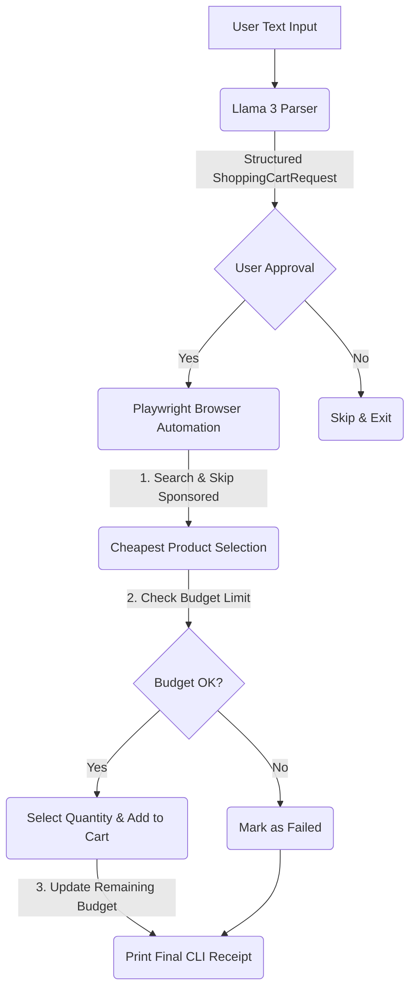

# Smart AI-Powered Shopping & Grocery Agent 🛒🤖

An intelligent, autonomous buying assistant that parses unstructured text shopping lists, analyzes product prices, respects strict budget limits, and automates product purchasing on Amazon using **Local LLMs** and **Playwright browser automation**.

---

## 🌟 Key Features

- **Unstructured Text Parsing**: Supply a raw text list (e.g., *"buy 2 bottles of shampoo and 1 pack of eggs under 500 rs"*).
- **Local LLM Parsing (Llama 3)**: Automatically converts raw lists into structured Pydantic JSON payloads specifying item names, optimized search queries, quantities, and budgets.
- **Smart Amazon Search Optimization**: Optimizes search terms by removing confusing adjectives/quantities and standardizing dimensions (e.g., converting "Coke 1L" to search query `Pepsi 1L`).
- **Autonomous Playwright Automation**: Bypasses bot detection using `playwright-stealth`, clicks pages, interacts with quantity selectors, and adds products directly to your Amazon cart.
- **Real-Time Budget Constraints**: Evaluates unit and total prices of the cheapest non-sponsored options. If an item exceeds your remaining budget, it is safely excluded from your purchase queue.
- **Structured Receipt Generation**: Outputs a clean CLI report summarizing successfully added items, total costs, failed items, and the remaining budget.

---

## 🛠️ System Architecture

The following diagram illustrates the end-to-end data flow of the agent:



### Folder Structure
```
VLM Project/
├── bot/
│   ├── agents/
│   │   └── shopping_agent.py   # Text-based LLM parsing (Llama 3 via Langchain)
│   ├── automation/
│   │   └── amazon_bot.py       # Playwright stealth browser automation & budget logic
│   └── core/
│       └── db.py               # Async MongoDB client setup (using motor)
├── .env.example                # Example configuration template
├── demo.py                     # CLI Interactive Dashboard (main orchestrator)
└── requirements.txt            # System dependencies
```

---

## 🚀 Installation & Setup

### 1. Prerequisites
Ensure you have the following installed on your system:
* **Python 3.10+**
* **MongoDB** (Running locally on `mongodb://localhost:27017`)
* **Ollama** (For running local LLMs)

### 2. Set Up Local Models
Make sure Ollama is installed and running, then pull the required model:
```bash
# Pull Llama 3 for text processing & structure formatting
ollama pull llama3
```

### 3. Install Dependencies
Set up your virtual environment and install the required packages:
```bash
# Create virtual environment
python -m venv venv

# Activate virtual environment
# On Windows:
.\venv\Scripts\activate
# On Linux/macOS:
source venv/bin/activate

# Install requirements
pip install -r requirements.txt

# Install Playwright browser engines
playwright install
```

### 4. Configuration
Create a `.env` file in the root directory (copied from `.env.example`):
```env
OLLAMA_BASE_URL=http://localhost:11434
MONGODB_URI=mongodb://localhost:27017
TELEGRAM_BOT_TOKEN=your_telegram_bot_token_here
```

---

## 💻 Usage

To launch the interactive terminal:
```bash
python demo.py
```

### Menu Options
1. **Enter text shopping list**: Provide a raw textual prompt. For example:
   > *"I want 3 bars of Dove soap, 1 tube of Colgate paste, and my budget is 800 rupees."*
2. **Exit**: Gracefully terminate the script.

### Automation Workflow
Once you confirm the parsed items, a Playwright Chromium window will spawn in **headful mode** (allowing you to monitor the automated operations). The script:
1. Searches Amazon India (`amazon.in`).
2. Iterates through search results, dismissing sponsored entries to pinpoint the organic, lowest-priced item.
3. Cross-references the total item cost with the remaining budget.
4. Spawns a tab for the product, configures the requested quantity, and adds it to your cart.
5. Holds the browser open for final review until you press **Enter** in your console.

---

## ⚠️ Key Considerations & Safety Limits

> [!IMPORTANT]
> The automation runs in **Headful Mode** (`headless=False`) so you can supervise actions. Do not close the browser manually; allow the script to prompt you in the console before closing.

> [!WARNING]
> This automation is designed for cart management. It **will not** complete checkouts, make purchases, or input payment credentials. Final checkouts must be handled manually by the user.

> [!NOTE]
> Prices are parsed in **INR (Rs.)** from the Amazon India portal by default (`amazon.in`). To target other regions (like `amazon.com`), modify the base URL and currency regex selectors inside `bot/automation/amazon_bot.py`.
